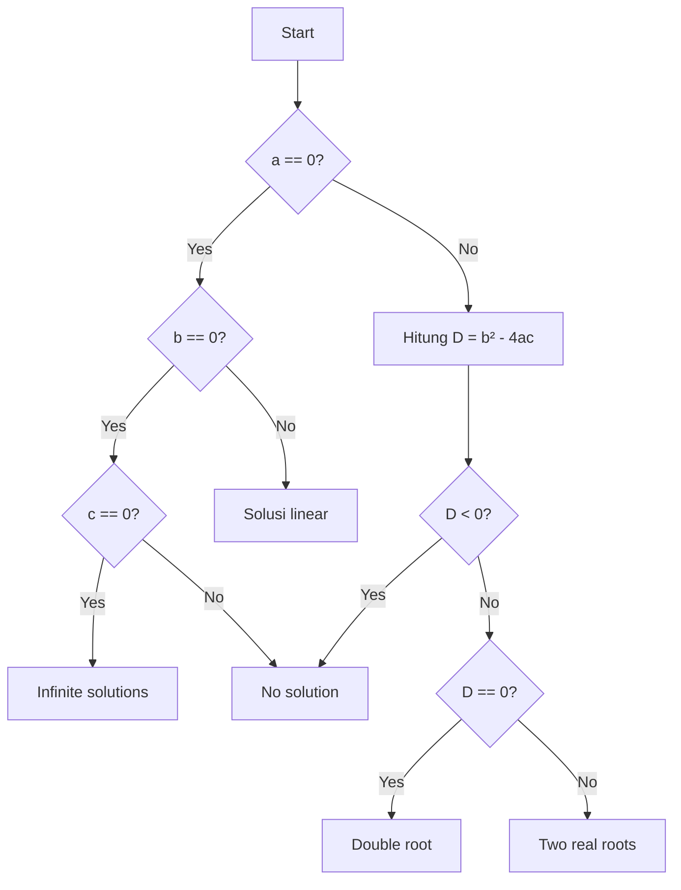

# Versi 4 — CFG Diagrams

Diagram berikut menggunakan Mermaid sehingga dapat dirender sebagai gambar/diagram pada GitHub.

## 1. Persamaan Kuadrat



Decision-level V(G) = 6.

## 2. Spring Owner.getPet()

```mermaid
flowchart TD
 A[Normalize name] --> B{Pet tersedia?}
 B -- No --> G[return null]
 B -- Yes --> C{!ignoreNew || !pet.isNew()?}
 C -- No --> B
 C -- Yes --> D[Get and normalize pet name]
 D --> E{compName equals name?}
 E -- Yes --> F[return pet]
 E -- No --> B
```

Decision-level V(G) = 4.

Catatan: operator 